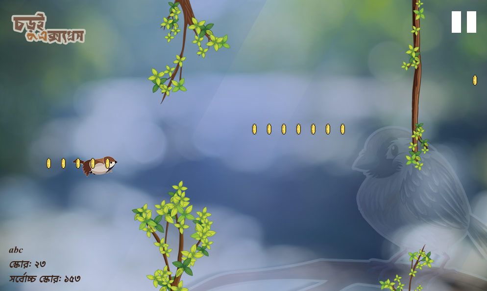

# Chorui Express

## Introduction
**Chorui Express** is a 2D side-scrolling game developed in C using the **iGraphics** and **iSound** libraries. The game follows the journey of a bird named **চড়ুই** (Chorui), where players must navigate obstacles, avoid enemies, and collect coins to score points.  

The game was built as a Level-1 Term-1 project.

### Team Members
- **ARJYA ASHRAF**
- **ABU UBIDA WADI**

### Supervisor
- **MAHIR LABIB DIHAN** (Adjunct Lecturer,CSE, BUET)

## Features
- A 2D side-scrolling gameplay experience with sprite-based design.  
- Player controls **Chorui**, flying through obstacles and enemies.  
- **Coins system**: collect coins to increase score; collisions may remove coins.  
- **Dynamic difficulty** with 3 levels:  
  - Level 1 → Easy (সহজ)  
  - Level 2 → Medium (মধ্যম)  
  - Level 3 → Hard (কঠিন)  
- **Leaderboard system**: saves player names with scores in sorted order.  
- **Sound & Music**: background music and sound effects, with toggle options (also available during pause).  
- **Collision detection** with coins, obstacles, and enemies.  
- **Replayability**: restart and resume options encourage multiple plays.  
- **Performance tracking**: highest scores recorded per session or per difficulty.  

## Technologies Used
- **C**  
- **iGraphics** for graphics rendering.  
- **iSound** for sound effects and music.  

## Screenshots
Here are some screenshots of **Chorui Express** gameplay:

  
*Main menu of the game.*

  
*Gameplay with obstacles and coins.*

  
*Game over screen with score and the high score.*

## How to Run the Game
Ensure you have the following installed:  
- **C Compiler** (e.g., GCC)  
- **iGraphics library**: [Modern iGraphics README](https://github.com/mahirlabibdihan/Modern-iGraphics/blob/8e4758f379ab15dfee0e536fb4503c6e121afe8c/README.md)  
- **iSound library** (for audio support)  

## Demo Video
Watch the gameplay video here:  

